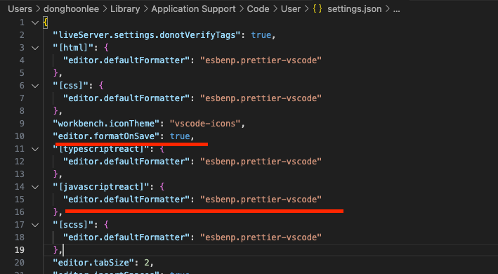

### Code Style 적용 가이드

1. npm install -D prettier
2. .prettierrc 파일에서 팀 내 스타일 적용
3. editor 내에서 Save on format 적용하여 저장할 때마다 포맷팅 해주기
   > vscode는 아래 사진과 같이 하면 됨
   > ctrl + shift + p 눌러 UserSettings에서 설정하면 됨
   > 
